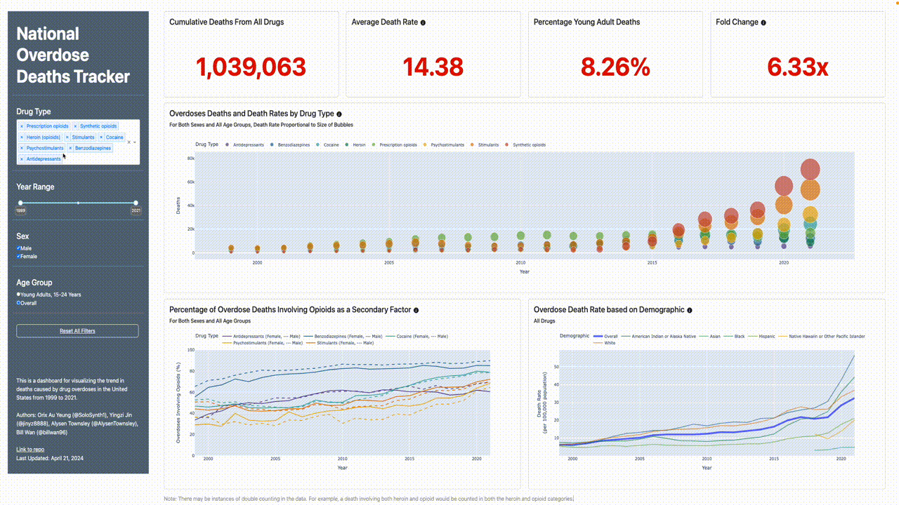

# The Slient Epidemic: National Drug Overdose Deaths

Dash dashboard visualizing America's drug overdose death rates.

**https://dsci-532-2024-16-silentepidemic.onrender.com**



## What are we doing:

### Problem & Importance
Dr. Darling and our group are concerned about the alarming rise in national drug overdose deaths and want to provide additional education for upper high school students. This issue is of significant concern due to several factors:
1. Increasing Overdose Deaths: Overdose deaths, especially those involving synthetic opioids like fentanyl, have increased significantly in recent years. This trend is not only concerning but also indicative of a larger, systemic issue that needs to be addressed.
2. Unintentional Overdoses: Many overdoses are unintentional, often occurring because individuals underestimate the dangers of mixing drugs or are unaware of the potency of the substances they are using. This lack of awareness and understanding significantly contributes to the high rates of overdose deaths.
3. Need for Education: There is a critical need for effective education programs that can equip students with the knowledge and skills to identify the risks of different drugs and recognize the signs and symptoms of overdose. Such education is crucial in preventing drug misuse and potentially saving lives.
4. Target Demographic: The target demographic for this education is upper high school students. This group is particularly important as they are at an age where they may be exposed to drugs and are at risk of drug misuse. By providing them with the necessary knowledge and understanding, we can empower them to make informed decisions and reduce the risk of drug overdose.

### How Our Dashboard Helps
The SilentEpidemic dashboard was created as a teaching tool for high school students in California. It is intended to raise awareness for the increasing rate of drug overdose deaths within the general population and within the 15-24 age group. The dashboard highlights the discrepancies in drug overdose deaths by ethnicity and gender, and also shows the rise in opioid-related deaths over time. 

Our dashboard visualizes:

- Overdose Trends: Shows a clear upward trend in national drug overdose deaths over time, particularly focusing on the rise in synthetic opioid-related deaths.
- Drug Risk Comparisons: Visually represents the relative risks associated with different drug categories, highlighting the dangers of synthetic opioids compared to other substances.
- Demographic Disparities: Highlights potential risk factors by ethnicity and gender to identify high-risk student populations.

## Contributing
Interested in contributing? Check out the [contributing guidelines](CONTRIBUTING.md). Please note that this project is released with a [Code of Conduct](CODE_OF_CONDUCT.md). By contributing to this project, you agree to abide by its terms.

## Running the Dashboard Locally
Below are some quick steps to run the app locally.
1. Clone the repo:
```bash
git clone git@github.com:UBC-MDS/DSCI-532_2024_16_SilentEpidemic.git
cd DSCI-532_2024_16_SilentEpidemic
```

2. Create and activate the virtual environment using `virtualenv`:
```bash 
virtualenv ./venv
source ./venv/bin/activate
```

3. Install all necessary packages via `pip`:
```bash
pip install -r requirements.txt
```

4. Run the dashboard:
```bash 
gunicorn src.app:server
```

## How to Get Help
Running into issues? Please feel free to create an issue in our GitHub repo and describe what is the problem.
When submitting the issue, please provide as much related information as possible so that we can find out the root causes and address them.  

## Contributors
The SilentEpidemic dashboard was created by Orix Au Yeung (@SoloSynth1), Yingzi Jin (@jinyz8888), Alysen Townsley (@AlysenTownsley), Bill Wan(@billwan96)

## License
The SilentEpidemic dashboard is licensed under the terms of the MIT license and [Creative Commons Attribution 4.0 International License](https://creativecommons.org/licenses/by/4.0/). Please refer to [the license file](LICENSE) for more information.

## References
1. Dataset Reference: National Institute on Drug Abuse. (2023). Overdose Data 1999-2021 [Excel file]. Retrieved from https://nida.nih.gov/sites/default/files/Overdose_data_1999-2021%201.19.23.xlsx
