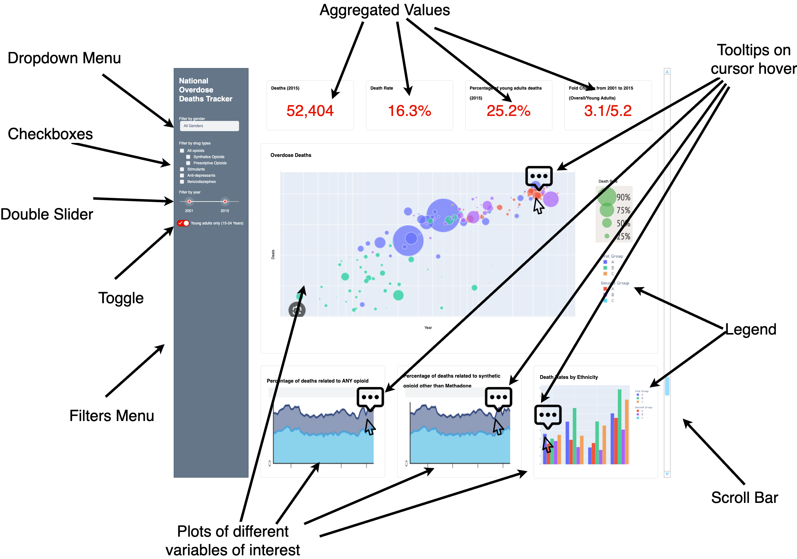

# Section 1: Motivation and Purpose
## 1. Target Audience & Your Role:
**Our Role**: Researchers at the National Institute on Drug Abuse (NIDA)

**Target Audience**: Dr. Linda Darling, State Board President, California State Board of Education

## 2. Problem & Importance:
Dr. Darling and our group are concerned about the alarming rise in national drug overdose deaths and want to provide additional education for upper high school students. This is crucial because:
- Drug overdose deaths involving synthetic opioids like fentanyl have increased significantly in recent years (https://www.cnn.com/2022/03/16/health/overdose-deaths-record-high-fentanyl/index.html)
- Many overdoses are unintentional, often occurring because people underestimate the dangers of mixing drugs (https://www.yalemedicine.org/news/fentanyl-driving-overdoses)
- Effective education programs can equip students with the knowledge and skills to identify the risks of different drugs and recognize the signs and symptoms of overdose. (https://www.samhsa.gov/sites/default/files/factsheet_educator_what_educators_can_do.pdf)

## 3. How Our Dashboard Helps:
Our dashboard would be able to picture the following:
- Overdose Trends: Show a clear upward trend in national drug overdose deaths over time, particularly focusing on the rise in synthetic opioid-related deaths.
- Drug Risk Comparisons: Visually represent the relative risks associated with different drug categories, highlighting the dangers of synthetic opioids compared to other substances.
- Demographic Disparities: Highlight potential risk factors by ethnicity and gender to identify high-risk student populations.

# Section 2: Description of the Data
In response to Dr. Darling's concern and NIDA's commitment to addressing the surge in drug overdose fatalities, we will visualize data on National Drug Overdose Deaths from 1999 to 2021, drawn from the CDC WONDER database. The dataset provides detailed information on overdose deaths across the United States, categorized by drug type and demographic variables, and is a rich resource for understanding the evolving landscape of drug overdose fatalities.

Key components of the dataset include:

1. Overall Overdose Death Counts and Rates: The total counts of drug overdose deaths are presented alongside age-adjusted rates per 100,000 population, highlighting the escalation in drug overdose deaths, to stress the urgency of informed preventative education. The age-adjusted mortality rates per 100,000 population facilitate a comparative analysis over time, despite demographic shifts. This dataset contains approximately 204 rows and 24 columns.

2. Age-Specific Overdose Data: Specifically targeting the 15-24 age demographic, the data offer insights into overdose deaths within this younger cohort, crucial for informing early prevention and educational initiatives. This subset includes around 130 rows and 24 columns.

3. Demographic-Specific Overdose Rates: Further, the dataset breaks down overdose death rates by demographic categories such as gender and ethnicity, age-adjusted per 100,000 population, ensuring our dashboard is tailored to addresss specific educational needs. It includes approximately 83 rows and 24 columns.

The primary variables that will drive our visual analysis include:

- Year: Temporal variable to illustrate time patterns, spanning from 1999 to 2021
- Gender: Categorical variable to draw out disparities in drug misuse impacts between males and females.
- Drug Categories: Categorical variable to elucidate the differential dangers they pose, including Any Opioid, Prescription Opioids, Heroin, Synthetic Opioids (other than Methadone, primarily fentanyl), Stimulants, Cocaine, and others.
- Demographic: Categorical variable, including White (Non-Hispanic), Black (Non-Hispanic), Asian* (Non-Hispanic), Native Hawaiian or Other Pacific Islander* (Non-Hispanic), Hispanic, American Indian or Alaska Native (Non-Hispanic)

A new variable, the 'Proportion of Deaths by Drug Type,' will be introduced to ascertain the most lethal drugs by taking the number of deaths attributable to each drug type and dividing it by the total number of overdose deaths. This metric will allow us to emphasize the disproportionate danger of certain substances, such as fentanyl, in our educational outreach.

Ideally, we would also have data on the educational backgrounds of individuals who succumbed to overdoses to directly link educational interventions to potential reductions in mortality rates. Although we can't engineer this from the available data, it would provide a more concrete foundation for our program's impact assessment.

Our visualizations aim to shed light on trends and changes in drug overdose deaths over the years. This crucial information directly addresses the concerns of our audience and aid healthcare professionals, policymakers, educators, and community leaders in developing targeted interventions and educational programs to prevent drug misuse and overdose, especially among youth, thereby aligning with NIDA's mission and Dr. Darling's objectives for the California State Board of Education.

# Section 3: Research Questions and Usage Scenarios
Dr. Darling is the State Board President of the California State Board of Education. She knows that the rate of national drug overdose deaths has been increasing over time in the United States and feels that there needs to be additional awareness raised on this topic amongst upper year high school students. As a result, she approached researchers from the National Institute on Drug Abuse (NIDA) and requested a customized dashboard which can be presented to students to educate them on the risks of drug overdose. Within the dashboard, she wants to display the relative risk of several types of drugs, as well as visualize the risk of overdose by ethnicity and gender to identify if any student populations are at higher risk of overdose. Lastly, she wants the dashboard to show overdose trends over time. 

Our team of researchers considered Dr. Darling’s request and developed a dashboard which contains a time series plot showing the overall total drug overdose deaths over time. This plot will also provide information regarding death rate intensity by group (such as drug type). In addition to the time series plot, visuals will include the percentage of deaths related to opioids and death rates by ethnicity and gender. Summary statistics will also be provided for ease of viewing, including the total deaths, death rate, percentage of young adults affected, and the fold change (the number of deaths of young people versus overall deaths over time).  

Dr. Darling and other teachers will be able to use this dashboard to educate students by utilizing the global filter pane to filter for gender, drug type, year, and age group to display the overdose deaths within each subgroup. This will provide students with an understanding of the relative risk of drug overdose in the United States, based on these factors. The teachers will also be able to list the summary statistics as a poignant reminder of the impact of drug overdose on the community and within similar demographic groups to the students (as shown by the gender, age group, and ethnicity filters). As many students are visual learners, the interactive dashboard will provide an easy to interpret method of educating students on this important problem.  

Overall, this dashboard will serve as a visual education tool to educate students on the real risk of drug overdose within society, and within their own age group. With this information, students will be able to make more informed personal choices regarding drug use. 

# Section 4: App Sketch & Brief Description

## App Sketch

## Brief Description

This app contains a landing page that shows the variables of interest from the dataset. This includes aggregated numbers such as overall overdose deaths and the fold increase in overdose cases during a specific time range. Plots including scatter plots, area plots and bar charts would be shown too to visualize the trend and the relationship between overdose cases and other related factors such as the type of drugs used and ethnicity. Tooltips would be popped up when the cursor hovers on the relevant data points.

The menu at the left side of the menu would be solely dedicated to filters, offering means for users to manipulate the extension of data the graphs would contains according to their queries. The menu would contain different ways to filter, including but not limited to dropdown menu for mutually exclusive categories, checkboxes for selecting multiple categories, and a slider for selecting time range. Finally, there will be a toggle button for toggling between datasets that encompass data from all ages and that contain data from only young adults.
